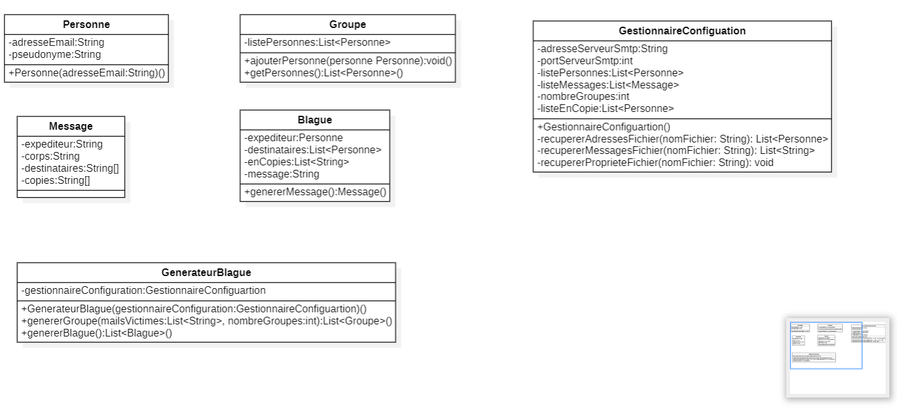

# DAI-2022-SMTP-Classe-B
##### Auteurs: Grégoire Guyot, Pablo Urizar

### Description de votre projet
L'objectif de ce laboratoire, est d'être capable d'utiliser un outil de ligne de commande pour communiquer avec un serveur SMTP et pouvoir envoyer des messages bien formés au serveur afin d'envoyer des e-mails aux adresses de notre choix .

### Qu'est-ce que MockMock ?
MockMock est un serveur SMTP qui accepte messages SMTP mais qui n'envoie pas d'e-mails réels à des destinations extérieures. 

Des faux serveurs SMTP sont souvent utilisés dans le but de tester une application. Par exemple, si nous développons une application qui envoie des mails, on souhaite généralement revérifier toutes les communications qui vont depuis notre application vers nos clients ou nos utilisateurs sans envoyer des vrais mails.

Dans le cas de notre projet, cela nous permet également d'éviter de spam des vrais serveurs SMTP.

### Instructions pour configurer votre faux serveur SMTP (MockMock)
Nous avons utilisé le serveur SMTP de test MockMock. Il faut d'abord cloner [this fork of MockMock server](https://github.com/DominiqueComte/MockMock) au lieu de la version officielle et exécutez `mvn clean package` pour générer un fichier .jar fonctionnel. La version officielle ne fonctionne plus avec Java 17.

Pour lancer MockMock dans le terminal il suffit d'exécuter le .jar généré:
`    java -jar <*nom_fichier_généré>*.jar`

Pour lancer MockMock dans un conteneur Docker une fois Docker est installé et lancé:
1. S'il s'agît de la première fois que vous exécutez le serveur MockMock sur docker, il faut lancer le script **mockmock/build-image.sh** qui va construire l'image docker.
2. Pour démarrer l'image et lancer le serveur exécuter le script **mockmock/run-container.sh**
3. Une fois les tests effectués, on peut arrêter l'instance de docker contenant mockmock en lançant la commande:
`docker stop mockmock`

Pour vérifier le bon fonctionnement, il suffit d'aller sur:
[http://localhost:8282](http://localhost:8282 "http://localhost:8282")

Après avoir lancé **mockmock/build.sh** on peut également spécifier le port de notre choix:
`docker run -d --rm --name mockmock -p 25:25 -p <port>:<port> mockmock`

### Instructions pour configurer et lancer le projet
Dans le dossier **config** contient toutes les informations nécessaires à modifier en fonction de ce que l'on veut faire. Par exemple dans le fichier **config/config.properties** pouvons spécifier l'adresse et le port du serveur SMTP à utiliser, le nombre de groupes ainsi que les adresses mail des temoins en copie si on veut.

Dans le fichier **config/messages.UTF8** nous pouvons modifier les messages qu'on aimerait envoyer en respectant la même syntaxe.

Finalement, le fichier **config/victimes.UTF8** contient la liste de mails des victimes qui recevront les mails.

Pour lancer le projet, nous devons nous retrouver à la racine du projet et dans le terminal lancer:
`mvn clean package`

Ceci va générer un fichier.jar que nous pouvons ensuite lancer avec:
`java -jar <fichier>.jar`

### Description de notre implémentation
Le projet est divisé en trois paquets. Le premier est le paquet mail qui contient les classes Personne, Groupe et Message. Une personne est définie par une adresseEmail et un pseudonyme qui sera déduit de l'adresse Email. Un groupe est définit par une list de personnes. Les instances de la classe Message contiennent toutes les informations d'un email, le corps du message, l'expéditeur, les gens en copies, les destinataires.
Le deuxième paquet est le paquet config qui contient une classe GestionnaireConfiguartion qui permet simplement d'aller chercher les configuartions à utiliser dans les fichiers victimes.UTF8 (contient les adresses Email des victimes), messages.UTF8 (qui contient les blagues à envoyer par Email) et config.properties qui lui contient quel serveur mail utiliser, qui mettre en copie (les témoins de la blague, le port SMTP et le nombre de groupes à créer.
Le paquet blague contient deux classes, GenerateurBlague qui va utiliser les configuration du GestionnaireConfiguartion pour créer une liste de groupe de victimes et une liste de blague. Ces blagues sont créées par la classe Blague qui gère les victimes et le message d'une blague en particuler.$
Le paquet smtp contient un simple clientSmtp qui va pouvoir envoyer des messages à un serveur précis sur une port précis.
Toutes ces classes sont liées dans l'application princpale App qui va dans l'ordre, récuperer les configuration, générer les groupes et les listes de blagues puis les envoyer.
Voila le diagramme de classe du projet qui contient les classes et leurs attributs et méthodes principales.

#### Références
[Serveur MockMock STMP](https://github.com/DominiqueComte/MockMock "Serveur MockMock STMP")
